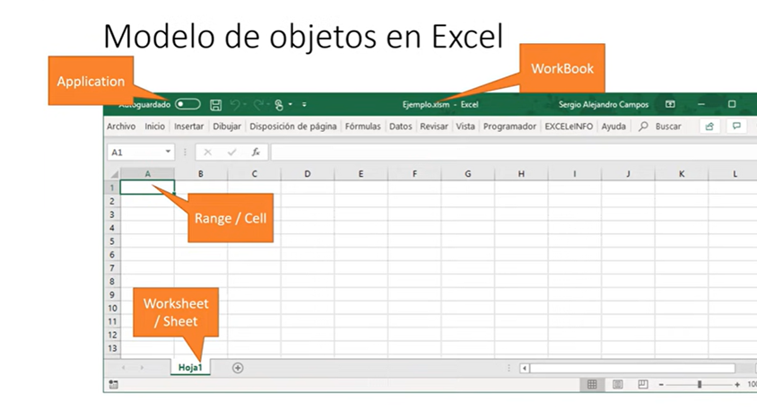
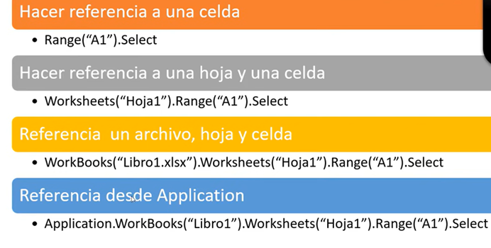

# Webinar -  MacroMando.xlsm

## Indice

- [Webinar -  MacroMando.xlsm](#webinar----macromandoxlsm)
  - [Indice](#indice)
  - [1. ¿Por qué aprender macros?](#1-por-qué-aprender-macros)
  - [2. Requisitos Previos](#2-requisitos-previos)
  - [3. Que Tener en Cuenta al Crear una Macro](#3-que-tener-en-cuenta-al-crear-una-macro)
    - [Gestión por mes](#gestión-por-mes)
  - [4. Indicadores graficos](#4-indicadores-graficos)
    - [Gestión por valor desembolsos](#gestión-por-valor-desembolsos)
    - [Gestión por mora inicial mes / por sucursal](#gestión-por-mora-inicial-mes--por-sucursal)
    - [Gestión por tipo identificación / capital inicio mes](#gestión-por-tipo-identificación--capital-inicio-mes)
    - [Gestión por tipo de alivio / por marca vehículo](#gestión-por-tipo-de-alivio--por-marca-vehículo)
    - [Gestión por producto / por tipo de prestamo](#gestión-por-producto--por-tipo-de-prestamo)
    - [Mejor gestión](#mejor-gestión)
    - [Mapa de calor y efectividad](#mapa-de-calor-y-efectividad)
    - [Gestión por asesor](#gestión-por-asesor)
    - [Gestión por canal y franja](#gestión-por-canal-y-franja)
  - [5. Contacto](#5-contacto)

## 1. ¿Por qué aprender macros?

- Usuario en Excel avanzado Y quiera pasar al siguiente nivel.
  
- Automatizar o hacer más eficiente el trabajo.
- Aprender un leguaje nuevo (VBA) es un lenguaje orientado a las aplicaciones de office o AutoCAD.
- Solicitud de reporterita automatizada.
- Conexión a otra aplicación de office, PowerPoint, Word..etc  (se tiene cierto nivel de conexión vía macros).

[Indice](#indice)

## 2. Requisitos Previos

- Manejar y conocer temas sobre celdas, Rangos, tablas, navegar entre hojas de cálculos y otros archivos.
- Manejo del Ribbon de Excel (Menú o cinta de opciones).
- Conocer las Fórmulas y funciones del Excel. 

[Indice](#indice)

## 3. Que Tener en Cuenta al Crear una Macro

- Las macros son un estilo de aplicaciones que se ejecutan mediante el lenguaje de VBA, antes de crear una macro se debe conocer para quien va dirigida y si es para un tercero debemos tener en cuenta:
  

### Con que elementos podrían tener interactividad las macros

## 4. Que es una Macro

- Una macro es un fragmento de código VBA que se puede ejecutar cuando sea necesario, existen macros grabadas y escritas en código desde 0, la diferencia de estas dos es que la primera al ser grabada se convierte en solo una serie de pasos cortos de comandos, en cambio a la segunda ya le podremos integrar mayor lógica y condiciones adicionales.

[Indice](#indice)

## 5. Tipos de archivos

- contamos con tres tipos de extenciones para los archivos de excel, la primera extención es en la que se guardan libros de la version 2003 conocida como .xls, para una mejor seguridad y buenas practicas apartir del 2007 en adelante se realizo la separacion de los paquetes de macros con el resto de los paquetes generando asi dos nuevas extenciones la .xlsx que es la de documentos que guardamos actualmente y la .xlsm que hacen referencia a los libros que contienen macros.

###  Configurar Pestaña Programador 

- Antes de iniciar con nuestro tema de macros debemos activar la pestaña en el ribbon donde estan las herramientas que se usaran para este tema, el paso a paso sera lo mismo para todas las versiones, lo unico que cambiara es que en la version del 2013 esta pestaña no se llama programador si no desarollador.

- Pasos para activar la pestaña programador:

## 6. Seguridad de Macros

- Antes de habilitar un documento macro debemos verificar que venga de un origen seguro ya que al usar el lenguaje VBA puede tener virus malicioso, antes de habilitamos contenido,opciones avanzadas en archivo, configuración centro de confianza, barras de mensajes, mostrar la barra de mensajes, opción configuración de macros.

Par mayor seguridad al momento de manejar macros debemos asegurarnos que estas ocpiones esten habilitadas en la opcion de seguridad con el fin de evitar que se ejecuten comandos o codigos no aprobados.

ActiveX:son los controles tipo boton,cuadro de texto y ComBoBox

## 7. Grabadora de Macros

- Es la herramienta que nos permite grabar los comandos o acciones que deseamos ejecutar en cualquier momento

- Cuando seleccionamos la opcion grabar macro nos aparecera la opcion de Nombre de la macro, método abreviado, guardar macro y la parte de la descripción

### Nombre:
- podemos colocar e nombre de nuestra preferencia se recomienda que sea un nombre corto que resuma que accion final tiene la acro, no puede contener espacios ni caracteres especiales.

### Método abreviado:
- Es una manera de activar nuestras macros por medio de comandos para hacer mucho más rapida su ejecucion, se recomienda no colocar funciones simples ( ctrl + (letra) ) ya que como excel cuenta con varios comandos por defecto podria ser sobre escribitos por las macros, procurar usar comandos adicionando la tecla shift para que el resultado final sea (ctrl + mayús + (letra))

### Guardar Macro

- Esta es la opcion que nos permite configurar las macros para que se puedan ejecutar sea en libros nuevos, unicamente en un libro especifico o en cualquier libro de excel que tengamos.

## 8. Tipos de referencias

- Existen dos tipos de referencias: relativas y absolutas. Las referencias relativas cambian cuando se copian de una celda a otra. Por otra parte, las referencias absolutas se mantienen constantes sin importar la celda en que se copien.

### Referencia Absoluta:

- Esta referencia la utilizaremos si queremos que la macro se ejecute en una celda en especifico junto con su resultado. 

## Referencia Relativa:

- Esta referencia la utilizaremos si queremos que la macro se ejecute en cualquier rango o celda que selecionemos.

Para sugerencias,dudas o peticiones contactar a los siguientes correos (Equipo IA DataPro):

*angie.jejen@finanzauto.com.co*

*adan.espinosa@finanzauto.com.co*

                                                    2023 © DataPro