# Webinar -  MacroMando.xlsm

## Indice

- [Webinar -  MacroMando.xlsm](#webinar----macromandoxlsm)
  - [Indice](#indice)
  - [1. ¿Por qué aprender macros?](#1-por-qué-aprender-macros)
  - [2. Requisitos Previos](#2-requisitos-previos)
  - [3. Que Tener en Cuenta al Crear una Macro](#3-que-tener-en-cuenta-al-crear-una-macro)
    - [Con que elementos podrían tener interactividad las macros](#Con-que-elementos-podrían-tener-interactividad-las-macros)
  - [4. Que es una Macro](#4-que-es-una-macro)
    - [Gestión por valor desembolsos](#gestión-por-valor-desembolsos)
    - [Gestión por mora inicial mes / por sucursal](#gestión-por-mora-inicial-mes--por-sucursal)
    - [Gestión por tipo identificación / capital inicio mes](#gestión-por-tipo-identificación--capital-inicio-mes)
    - [Gestión por tipo de alivio / por marca vehículo](#gestión-por-tipo-de-alivio--por-marca-vehículo)
    - [Gestión por producto / por tipo de prestamo](#gestión-por-producto--por-tipo-de-prestamo)
    - [Mejor gestión](#mejor-gestión)
    - [Mapa de calor y efectividad](#mapa-de-calor-y-efectividad)
    - [Gestión por asesor](#gestión-por-asesor)
    - [Gestión por canal y franja](#gestión-por-canal-y-franja)
  - [5. Tipos de archivos](#5-tipos-de-archivos)
    - [Configurar Pestaña Programador](#configurar-pestaña-programador)
  - [6. Seguridad de Macros](#6-seguridad-de-macros)
  - [7. Grabadora de Macros](#7grabadora-de-macros)
  - [8. Tipos de referencias](#8-tipos-de-referencias)
  - [9. Maneras de ejecutar macros](9.-maneras-de-ejecutar-macros)
  - [10. Primer Caso de Uso](#10-primer-caso-de-uso)
  - [11. Primer Caso de Uso](#11-primer-caso-de-uso)
  - [12. VBA](#12-VBA)
  - [13. VBE](#13-VBE)
  - [14. Modelos de Objetos en Excel, Propiedades y Metodos](#14-modelos-de-objetos-en-excel-propiedades-y-Metodos)
  - [15. Propiedades y Metodos más Usados en Excel](#15-propiedades-y-metodos-mas-usados-en-excel)
  - [16. Ejempos de Validacion de Codigos](#16-ejempos-de-validacion-de-codigos)

# 1. ¿Por qué aprender macros?

- Usuario en Excel avanzado Y quiera pasar al siguiente nivel.
  
- Automatizar o hacer más eficiente el trabajo.
- Aprender un leguaje nuevo (VBA) es un lenguaje orientado a las aplicaciones de office o AutoCAD.
- Solicitud de reporterita automatizada.
- Conexión a otra aplicación de office, PowerPoint, Word..etc  (se tiene cierto nivel de conexión vía macros).

[Indice](#indice)

# 2. Requisitos Previos

- Manejar y conocer temas sobre celdas, Rangos, tablas, navegar entre hojas de cálculos y otros archivos.
- Manejo del Ribbon de Excel (Menú o cinta de opciones).
- Conocer las Fórmulas y funciones del Excel. 

[Indice](#indice)

# 3. Que Tener en Cuenta al Crear una Macro

- Las macros son un estilo de aplicaciones que se ejecutan mediante el lenguaje de VBA, antes de crear una macro se debe conocer para quien va dirigida y si es para un tercero debemos tener en cuenta:
  

### Con que elementos podrían tener interactividad las macros

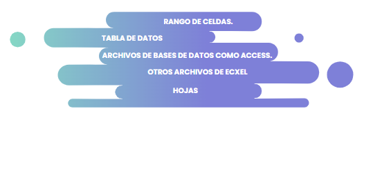

# 4. Que es una Macro

- Una macro es un fragmento de código VBA que se puede ejecutar cuando sea necesario, existen macros grabadas y escritas en código desde 0, la diferencia de estas dos es que la primera al ser grabada se convierte en solo una serie de pasos cortos de comandos, en cambio a la segunda ya le podremos integrar mayor lógica y condiciones adicionales.

[Indice](#indice)

# 5. Tipos de archivos

- contamos con tres tipos de extenciones para los archivos de excel, la primera extención es en la que se guardan libros de la version 2003 conocida como .xls, para una mejor seguridad y buenas practicas apartir del 2007 en adelante se realizo la separacion de los paquetes de macros con el resto de los paquetes generando asi dos nuevas extenciones la .xlsx que es la de documentos que guardamos actualmente y la .xlsm que hacen referencia a los libros que contienen macros.

###  Configurar Pestaña Programador 

- Antes de iniciar con nuestro tema de macros debemos activar la pestaña en el ribbon donde estan las herramientas que se usaran para este tema, el paso a paso sera lo mismo para todas las versiones, lo unico que cambiara es que en la version del 2013 esta pestaña no se llama programador si no desarollador.

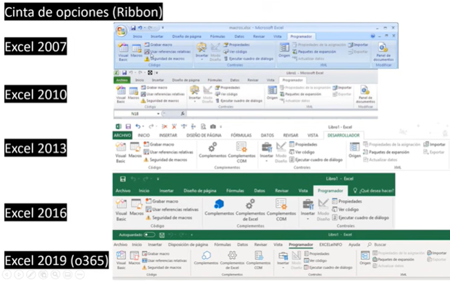

- Pasos para activar la pestaña programador:

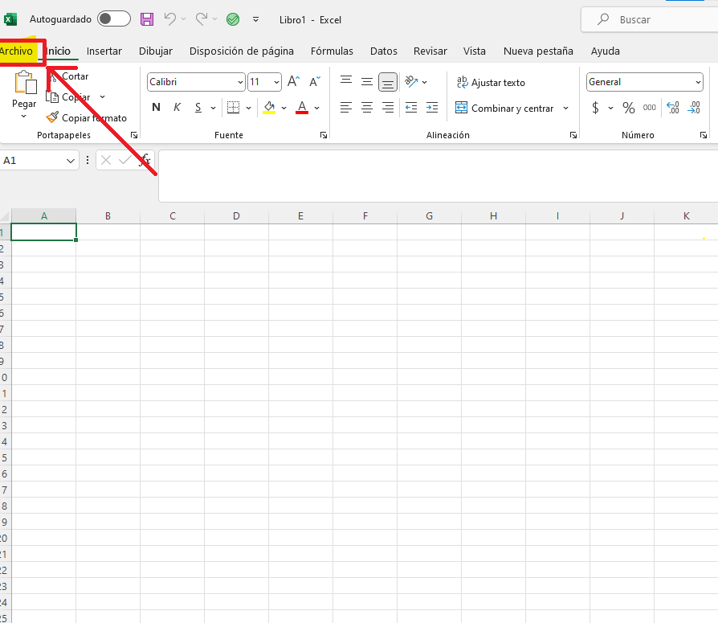

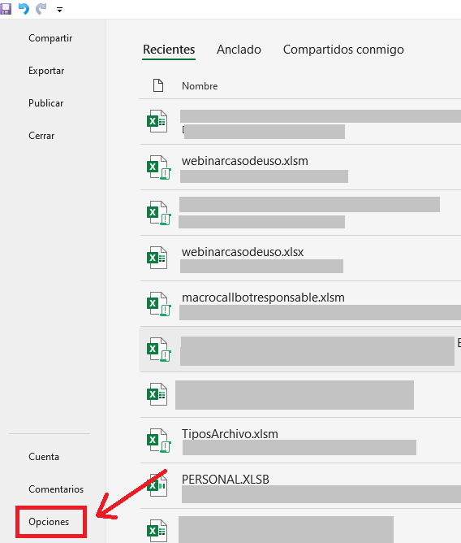

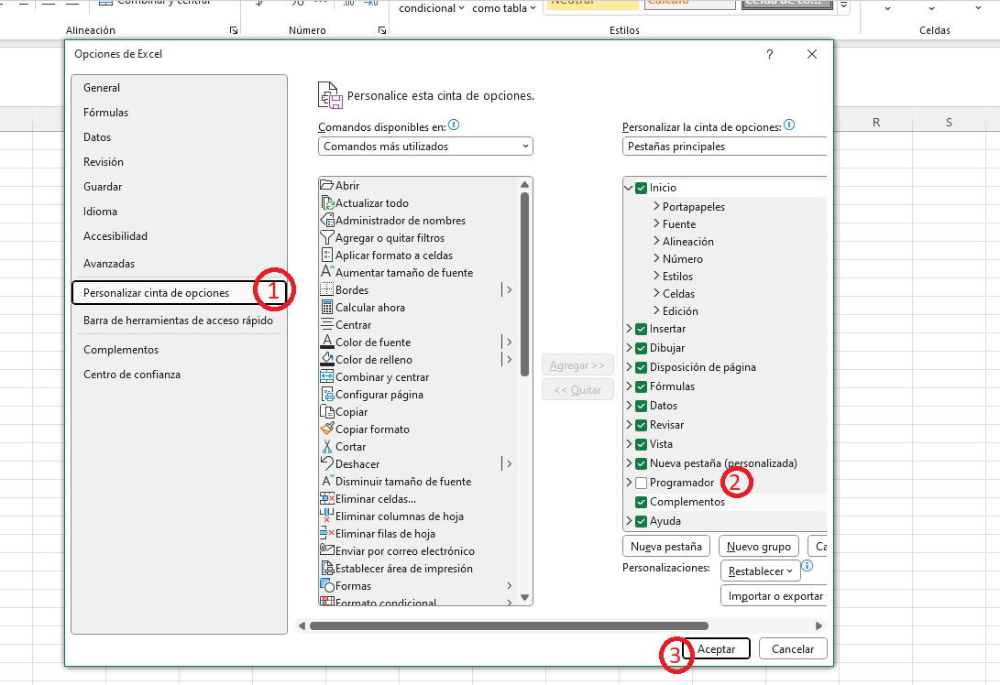

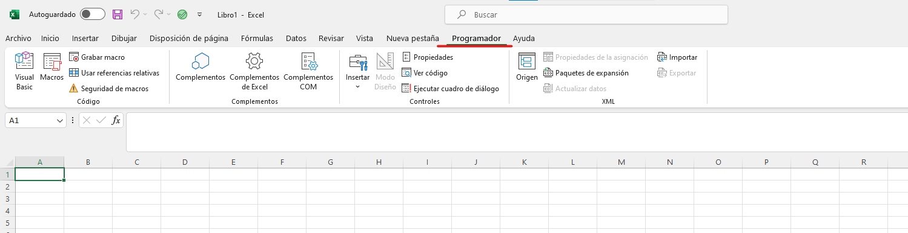

# 6. Seguridad de Macros

- Antes de habilitar un documento macro debemos verificar que venga de un origen seguro ya que al usar el lenguaje VBA puede tener virus malicioso, antes de habilitamos contenido,opciones avanzadas en archivo, configuración centro de confianza, barras de mensajes, mostrar la barra de mensajes, opción configuración de macros.

Par mayor seguridad al momento de manejar macros debemos asegurarnos que estas ocpiones esten habilitadas en la opcion de seguridad con el fin de evitar que se ejecuten comandos o codigos no aprobados.

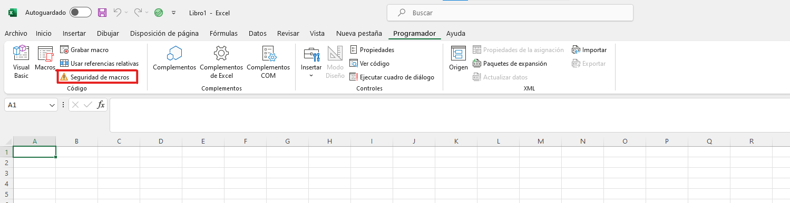

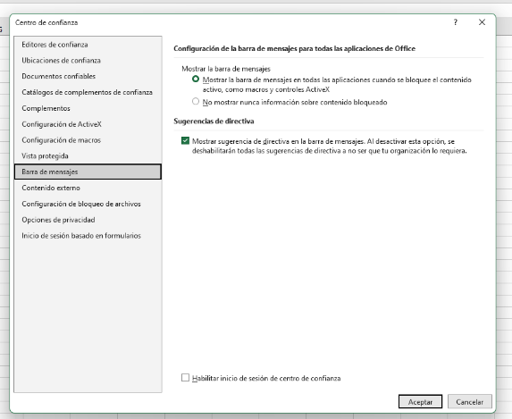

ActiveX:son los controles tipo boton,cuadro de texto y ComBoBox

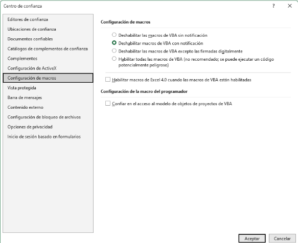

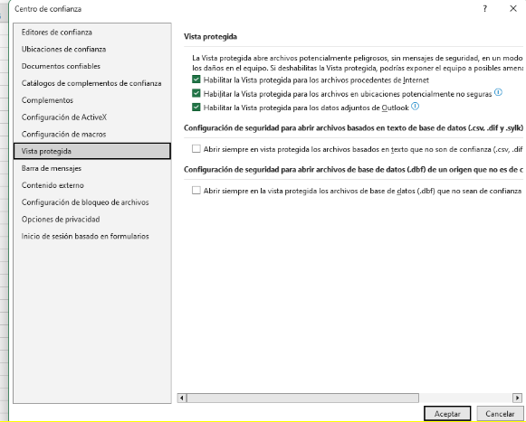

# 7. Grabadora de Macros

- Es la herramienta que nos permite grabar los comandos o acciones que deseamos ejecutar en cualquier momento

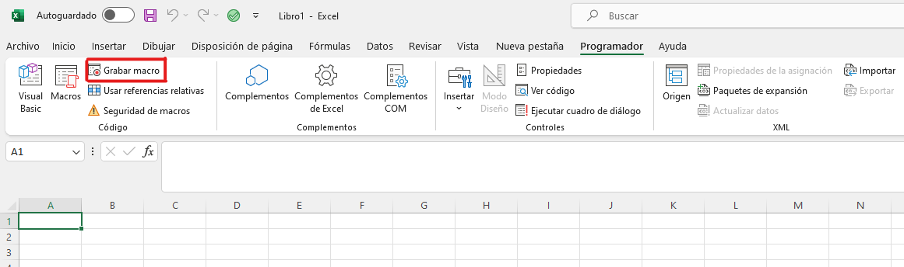

- Cuando seleccionamos la opcion grabar macro nos aparecera la opcion de Nombre de la macro, método abreviado, guardar macro y la parte de la descripción

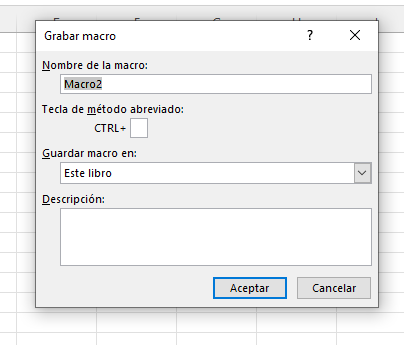

### Nombre:
- podemos colocar e nombre de nuestra preferencia se recomienda que sea un nombre corto que resuma que accion final tiene la acro, no puede contener espacios ni caracteres especiales.

### Método abreviado:
- Es una manera de activar nuestras macros por medio de comandos para hacer mucho más rapida su ejecucion, se recomienda no colocar funciones simples ( ctrl + (letra) ) ya que como excel cuenta con varios comandos por defecto podria ser sobre escribitos por las macros, procurar usar comandos adicionando la tecla shift para que el resultado final sea (ctrl + mayús + (letra))

### Guardar Macro

- Esta es la opcion que nos permite configurar las macros para que se puedan ejecutar sea en libros nuevos, unicamente en un libro especifico o en cualquier libro de excel que tengamos.

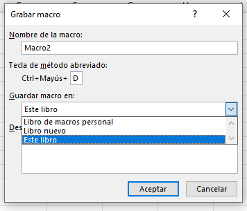

# 8. Tipos de referencias

- Existen dos tipos de referencias: relativas y absolutas. Las referencias relativas cambian cuando se copian de una celda a otra. Por otra parte, las referencias absolutas se mantienen constantes sin importar la celda en que se copien.

### Referencia Absoluta:

- Esta referencia la utilizaremos si queremos que la macro se ejecute en una celda en especifico junto con su resultado. 

### Referencia Relativa:

- Esta referencia la utilizaremos si queremos que la macro se ejecute en cualquier rango o celda que selecionemos.

- En el siguiente video se podra visualizar la diferencias entre estas dos opciones y el porque cada una podria aplicar para diferentes casos.

- En los videos anteriores donde veiamos como crear cada referencia se veia el proceso pero al mirar este ejemplo podemos ver que si le adicionara dos columnas más a la base y ejecutara la sentencia absoluta sobre escibiria mis datos ya que al grabarla de esta manera la macro entiende que siempre tendra que poner el total en la misma celda en este caso E5 en cambio al ejecutar la relativa podremos observar que este total siempre quedara una columa despues de la base ya que al tomarla como relativa se le indica un valor de rango en este caso es que siempre se ejecute una fila despues de la ultima columna de la base (No se le condicona una celda donde deba ejecutarse por obligación).

# 9. Maneras de ejecutar macros

Tenemos Varias opciones para poder ejecutar nuestras macros algunas de ellas son:

- La primera opcion es con la que hemos trabajado normalmente, atravez de nuestra pestaña programador podremos acceder a la opcion de macros señecionar la que deseamos y seleccionamos la opcion ejecutar.

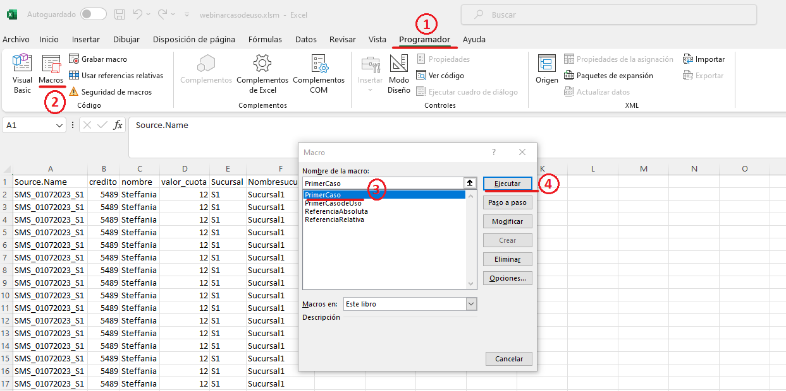

- La segunda opcion puede ser un procedimiento similar al anterior en el que seleccionamos la pestaña vista y despues la opcion de macros señecionar la que deseamos y seleccionamos la opcion ejecutar.

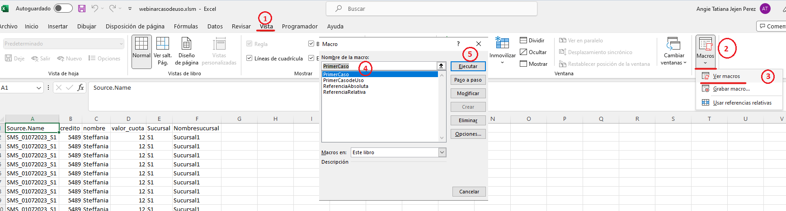

- Para nuestra tercera opcion tenemos los comandos del teclado que podemos configurar cuando vamos a grabar la macro.

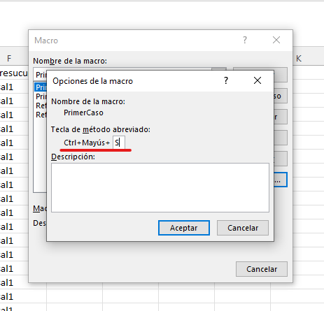

- Si la macro es para la automatizacion de una tarea recurrente lo que podemos crear es un acceso rapido este se puede configurar ingresando por la pestaña archivos - opciones - Barra de herramientas de acceso rapido - selecionamos en comandos disponibbles (macros) - selecionamos la macro que queremos que quede para ajecución - selecionamos agregar y podemos configurarla para colocarle el icono o simbolo que deseamos y por ultimo aceptar.

- Otra manera de Organizar nuestras Macros y ejecutarlas en un mejor orden es configurar la cinta de opciones (Ribbon) para poder crear una pestaña solo para nuestras macros o accesos rapido que usemos más frecuentes y esta activacion se puede realizar ce una forma muy parecida a la anterior ingresando por la pestaña archivos - opciones - personalizar cinta de opciones- en la parte de la derecha seleccionamos el boton nueva pestaña, le asignamos un nombre y en la parte izquierda en comando disponibles selecionamos la opcion de macros - selecionamos la macro que deseamos que se  ejecute - selecionamos agregar y por ultimo aceptar.

-Por ultimo tenemos la opcion que se ejecute mediante una figura,forma o boton esta alternativa es muy practica cuando deseamos realizar formularios o diseños practicos de reporeria para que sea más facil de ejecutar para el usuario final que consumira el reporte

# 10. Primer Caso de Uso

- En este caso se grabara una macro con referencia absoluta para mostrar como ejecuta los comandos exactamente como nosotros los realizamos, es importante tener en cuenta que estos pasos deben estar bien estructurados.

# 11. Primer Caso de Uso

- En este proyecto grabaremos una macro con la convinación de referencia absoluta y relativa para mostrar como podemos hacer que los datos de una hoja pasen a otra y vayan quedando almacenados en forma tabular quiere decir en filas y columnas como las bases de datos.

Sede teneren cuenta que cuando se realizan procesos con la referencia relativa en mejor utilizar comandos de teclado para grabar los pasos, por ejemplo cuando pasamos a la segunda hoja a pegar los datos para que se seleccione la celda dejado de titulo utilizamos ctrl+(flecha hacia abajo) y luego nuevamente flecha hacia abajo.

# 12. VBA

# 13. VBE

El editor de VBE lo podemos activar mediante la opcion que esta ne la pestaña programador llamada Visual Basic o por el comando Alt + F11

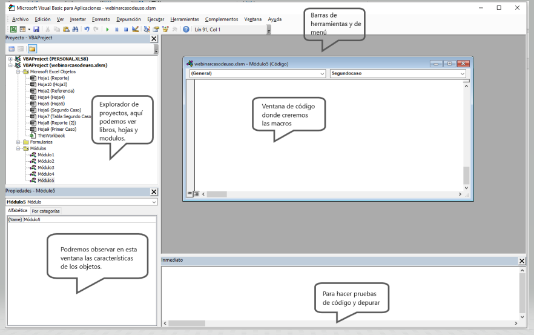

# 14. Modelos de Objetos en Excel, Propiedades y Metodos 

### Objetos en Excel: 

*-* Workbook:  Libro o documento en el que estamos trabajando.

*-* Worksheet: Hoja  en la que se esta trabajando.

*-* Range/Cell: rango o celda.

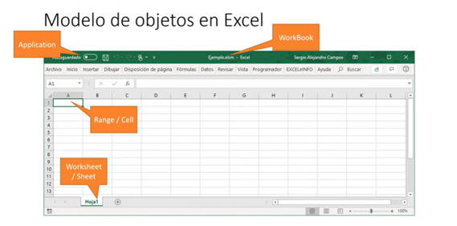

Es muy importante saber que en el momento que se esta ya digitando el codigo despues de cada objeto debe ir el signo del punto (.)

Ejemplo de Jerarquías de objetos, de lo particular a lo general

Hacer referencia a celdas:

- Rabger("A1").Select

 Hacer referencia a hoja y celda:

- Worksheets("Hoja1").Range("A1").Select

Referencia un archivo, hoja y celda:

- WorkBooks("Libro1.xlsx").Worksheets("Hoja1").Range("A1").Select

Referencia desde una aplicación

- Application.WorkBooks("Libro1.xlsx").Worksheets("Hoja1").Range("A1").Select

### Ejemplo de Objetos:

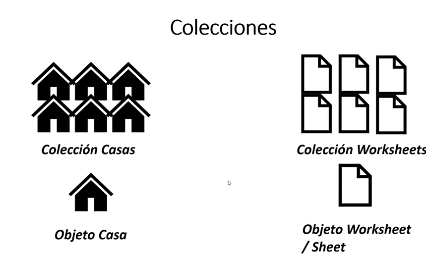

### Propiedades y Metodos

### Propiedades

Las propiedades se pueden entender por las caracteristicas de los objetos, un ejemplo puede se un celular sus propiedades podrian ser tamaño, peso, color,pixeles,almacenamiento.... etc.

### Metodos

Los metodos se pueden entender por las acciones de los objetos, un ejemplo que podriamos usar como en el anterior podria ser el celular hacer llamadas, eviar mensajes, tomar fotos, abrir aplicaciones .... etc 

### Ejemplo de Propiedades y Metodos

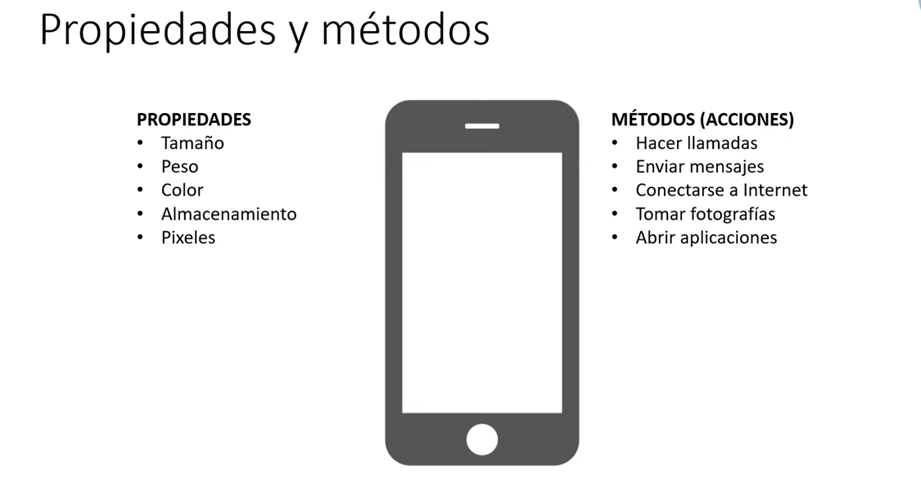

En la siguiente imagen podemos ver un ejemplo de como deberiamos llamar las propiedades o metodos en el lenguaje VBA en este caso el objto es SmartPhone seguido del signo punto (.) para llamar la propiedad o metodo

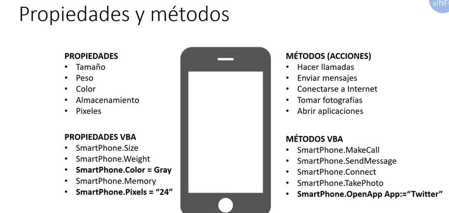

# 15. Propiedades y Metodos más Usados en Excel

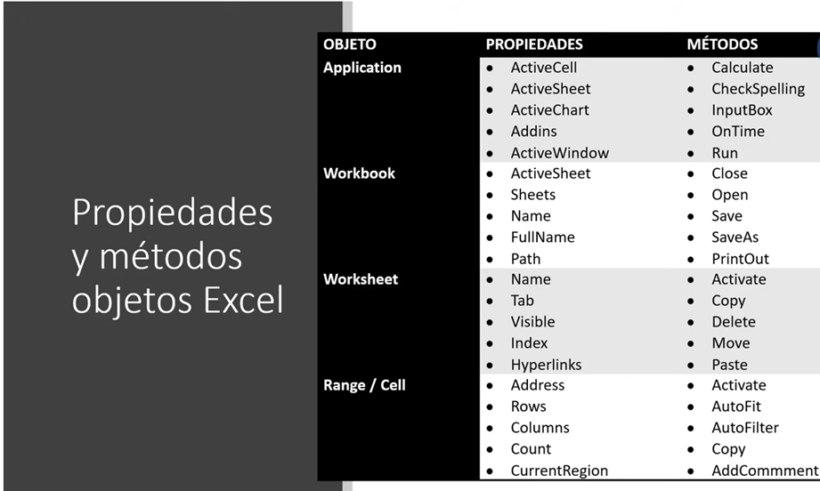

### Ejemplos de aplicación de Propiedades y Metodos 

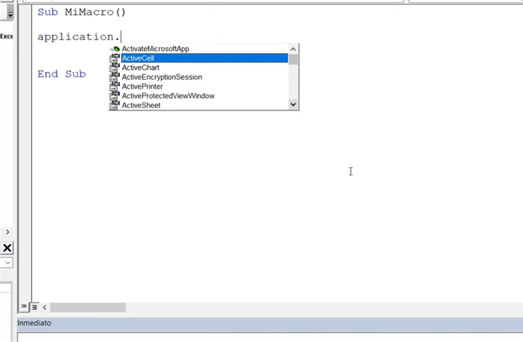

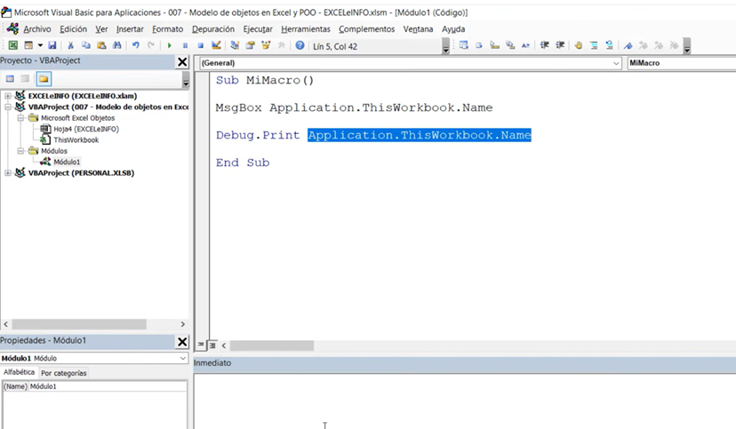

En este ejemplo podemos ver como llamamos al objeto Application y con el signo punto le indicamos el siguiente objeto ThisWorkbook (Esta hoja) y la propiedad Name (nombre) quiere decir que queremos saber el nombre de la hoja actual que estamos editando

*-* Nota: si queremos que la información aparezca e la consola inmediato debems utilizar Debug.Print o directamente escribir en esta funcion el fracmento del codigo iniciando con el signo de interogación (?) seguido de Application.ThisWorkbook.Name como se observa en la parte inferiror de la imagen 

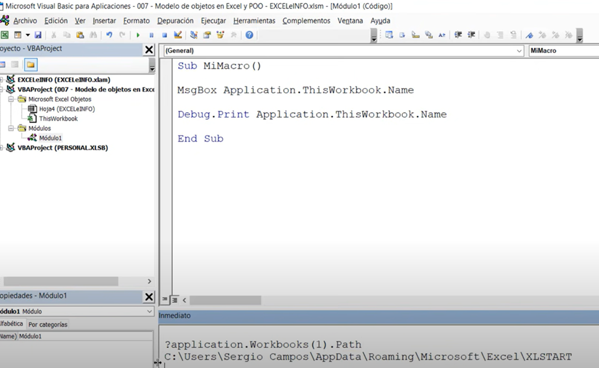

# 16. Ejempos de Validacion de Codigos 

Para validar que hace un codigo lo que se puede es abri el VBE y ajustarla en la parte derecha que se pueda en la izquierda observar el libro donde se ejecuta la macro y mediante la techa F8 recore por fraccion de codigo que hace cada linea 

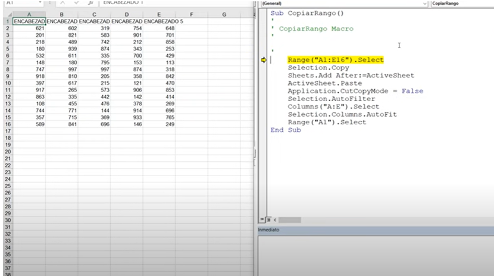

Para sugerencias,dudas o peticiones contactar a los siguientes correos (Equipo IA DataPro):

*angie.jejen@finanzauto.com.co*

                                                    2023 © DataPro