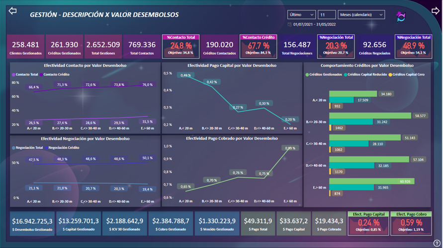
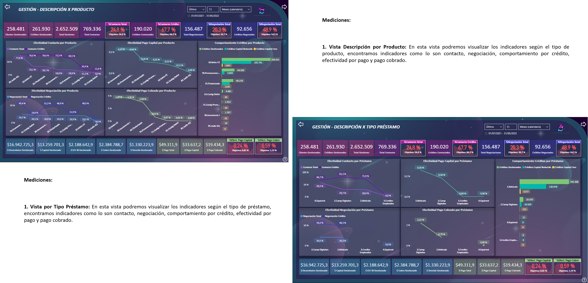
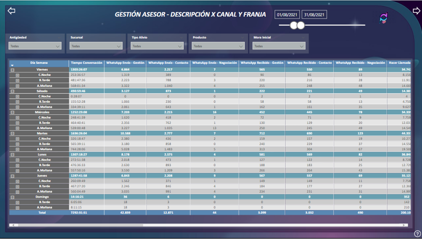

# Webinar -  MacroMando.xlsm

## Indice

- [Webinar -  MacroMando.xlsm](#webinar----macromandoxlsm)
  - [Indice](#indice)
  - [1. ¿Por qué aprender macros?](#1-por-qué-aprender-macros)
  - [2. Requisitos Previos](#2-requisitos-previos)
  - [3. Que Tener en Cuenta al Crear una Macro](#3-que-tener-en-cuenta-al-crear-una-macro)
    - [Gestión por mes](#gestión-por-mes)
  - [4. Indicadores graficos](#4-indicadores-graficos)
    - [Gestión por valor desembolsos](#gestión-por-valor-desembolsos)
    - [Gestión por mora inicial mes / por sucursal](#gestión-por-mora-inicial-mes--por-sucursal)
    - [Gestión por tipo identificación / capital inicio mes](#gestión-por-tipo-identificación--capital-inicio-mes)
    - [Gestión por tipo de alivio / por marca vehículo](#gestión-por-tipo-de-alivio--por-marca-vehículo)
    - [Gestión por producto / por tipo de prestamo](#gestión-por-producto--por-tipo-de-prestamo)
    - [Mejor gestión](#mejor-gestión)
    - [Mapa de calor y efectividad](#mapa-de-calor-y-efectividad)
    - [Gestión por asesor](#gestión-por-asesor)
    - [Gestión por canal y franja](#gestión-por-canal-y-franja)
  - [5. Contacto](#5-contacto)

## 1. ¿Por qué aprender macros?

- Usuario en Excel avanzado Y quiera pasar al siguiente nivel.
  
- Automatizar o hacer más eficiente el trabajo.
- Aprender un leguaje nuevo (VBA) es un lenguaje orientado a las aplicaciones de office o AutoCAD.
- Solicitud de reporterita automatizada.
- Conexión a otra aplicación de office, PowerPoint, Word..etc  (se tiene cierto nivel de conexión vía macros).

[Indice](#indice)

## 2. Requisitos Previos

- Manejar y conocer temas sobre celdas, Rangos, tablas, navegar entre hojas de cálculos y otros archivos.
- Manejo del Ribbon de Excel (Menú o cinta de opciones).
- Conocer las Fórmulas y funciones del Excel. 

[Indice](#indice)

## 3. Que Tener en Cuenta al Crear una Macro

- Las macros son un estilo de aplicaciones que se ejecutan mediante el lenguaje de VBA, antes de crear una macro se debe conocer para quien va dirigida y si es para un tercero debemos tener en cuenta:
  

### Con que elementos se tendra interactividad las macros

## 4. Que es una Macro

- Una macro es un fragmento de código VBA que se puede ejecutar cuando sea necesario, existen macros grabadas y escritas en código desde 0 la diferencia de estas dos es que la primera al ser grabada se convierte en solo una serie de pasos cortos de comandos en cambio a la segunda ya le podremos integrar mayor lógica y condiciones adicionales.

**- Efectividad Contacto Por Año Desembolso:** Gestiones realizadas al cliente por parte del asesor.

**- Efectividad Negociación Por Año Desembolso:** Negociaciones según la fecha realizadas a cliente con ese año de desembolso.

**- Efectividad Pago Capital Por Año Desembolso:** Efectividad de pago de cliente con ese año de desembolso.

**- Efectividad Pago Cobrado Por Año Desembolso:** Efectividad de pago cobrado por cliente con ese año de desembolso.

**- Créditos Reducen Capital Por Año Desembolso:** Clientes que han reducido su Capital desde el año de desembolso

[Indice](#indice)

### Gestión por valor desembolsos

[Indice](#indice)

### Gestión por mora inicial mes / por sucursal

[Indice](#indice)

### Gestión por tipo identificación / capital inicio mes

[Indice](#indice)

### Gestión por tipo de alivio / por marca vehículo

[Indice](#indice)

### Gestión por producto / por tipo de prestamo

[Indice](#indice)

### Mejor gestión

**- Cantidad Créditos por Mejor Gestión:** Son  la cantidad de créditos que han tenido como mejor gestión  cada una de las siguientes tipificaciones (Rango Y).

**- Valor capital por Mejor Gestión :** El valor capital de los créditos que se han gestionado y su respectiva mejor tipología (Rango Y).

**- Cliente reduce capital  por Mejor Gestión:** La cantidad de créditos que se han gestionado su respectiva mejor tipología y que han reducido su capital según la fecha filtrada (Rango Y).

**- Valor Pago por Mejor Gestión :** El valor de pago a cuotas que registran con esa tipología de mejor gestión del asesor, para saber de que tipo de gestión fue que entró el pago

[Indice](#indice)

### Mapa de calor y efectividad

**- % Efect.Contacto Por Fecha:** Porcentaje de Contacto por fecha.

**- % Efect.Negociación Por Fecha:** Porcentaje de negociación por fecha.

**- % Efect.Pago Acuerdo por Semana Año:** Porcentaje de los pagos de los acuerdos realizados por semana.

**- Mapa de Calor :** Son los porcentajes de contacto y negociación de los créditos  según días calendario de la fecha filtrada, estos indicadores cuentan con formato condicional que nos indicaran en rojo los días que fueron menos efectivos y en verde los más efectivos.

*Nota:* Es importante tener en cuenta que estos calendarios funciona solo si se filtra mes único, no varios meses

[Indice](#indice)

### Gestión por asesor

**- Filtro por indicadores temporales:** Línea de tiempo por meses, esta puede ser modificada para seleccionar un campo específico de días que no interrumpa el espacio entre tablas dinámicas.

**- Filtro por Rangos:** Sucursal, Tipo Alivio, Producto y Mora Inicial

**- Tiempo Conversación:** Tiempo total de gestión de llamadas   (tipificación, llamada, observaciones).

**- TMO Promedio:** Tiempo promedio de una gestión.

**- Gestión:** Cantidad de registros tipificados

**- Clientes Gestión:** Cantidad de registros tipificados por titular

**- Cuentas Gestión:** Cantidad de registros tipificados por crédito

**- Teléfono Gestión:** Total de teléfonos gestionados por el asesor.

**- Contacto:** Llamadas que tiene contactos efectivos con titular

**- Cuenta Contacto:** Llamadas que tiene contactos efectivos con titular por crédito

**- %Contacto:** Total llamadas en porcentaje  donde se tiene contacto efectivo con el titular

**- Negociación:** Llamadas donde se realiza un acuerdo de pago con el cliente

**- Cuenta Negociación:** Llamadas donde se realiza un acuerdo de pago por crédito

**- %Negociación:** Total llamadas en porcentaje donde se realiza un acuerdo de pago con el cliente

**- Valor pago Total:** pagos aplicados a Capital intereses y otro

**- Valor pago Capital:** Pagos aplicados a capital

**- Valor pago Cobro:** Pagos aplicados a valor vencido o cuota

**- Valor pago Contacto:** Pagos con contacto efectivo (pagos totales aplicados)

**- Valor pago Acuerdo:** Pagos  de acuerdos (pagos totales aplicados)

[Indice](#indice)

### Gestión por canal y franja

En esta matriz se podrán observar por día de la semana y franja horaria la gestión de asesores por canal como los siguientes indicadores :

**- Tiempo Conversación:** Tiempo total de gestión de llamadas   (tipificación, llamada, observaciones).

**- WhatsApp Envío – Gestión:** Gestiones outbound en las que se genero un registro de tipificación.

**- WhatsApp Envío – Contacto:** Gestiones outbound  tipificadas como contacto con titular.

**- WhatsApp Envío – Negociación:** Gestiones outbound tipificadas como negociación con titular.

**- WhatsApp Recibido – Gestión:** Gestiones inbound en las que se genero un registro de tipificación.

**- WhatsApp Recibido – Contacto:** Gestiones inbound tipificadas como contacto con titular.

**- WhatsApp Recibido – Negociación:** Gestiones inbound tipificadas como negociación con titular.

**- Hacer Llamada- Gestión:** llamadas outbound en las que se genero un registro de tipificación.

**- Hacer Llamada- Contacto :** llamadas outbound tipificadas como contacto con titular.

**- Hacer Llamada- Negociación :** llamadas outbound tipificadas como negociación con titular.

**- Recibir Llamada- Gestión:** llamadas inbound en las que se genero un registro de tipificación.

**- Recibir Llamada- Contacto :** llamadas inbound tipificadas como contacto con titular.

**- Recibir Llamada- Negociación :** llamadas inbound tipificadas como negociación con titular.

**- Solicitud Visita – Gestión:**  Gestiones que registran tipificación de solicitud de visita por parte del titular.

**- Solicitud Visita – Contacto:** Gestiones que registran tipificación de contacto y solicitud de visita por parte del titular.

**- Solicitud Visita – Negociación:** Gestiones que registran tipificación negociación y solicitud de visita por parte del titular.

**- Valor pago Total:**  La sumas de pagos Capital, intereses y seguros (solo se reflejan los que cuentan con gestión asesor).

**- Valor pago Capital:** Pagos aplicados solo a capital (solo se reflejan los que cuentan con gestión asesor).

**- Valor pago Cobro:**  Pagos  aplicados a saldo vencido o cuota mes (solo se reflejan los que cuentan con gestión asesor).

**- Valor pago Contacto:**  Pagos Totales pero aplicado a los clientes que han sido contactados (solo se reflejan los que cuentan con gestión asesor).

**- Valor pago Acuerdo:** Pagos Totales pero aplicado a los clientes que han sido negociados (solo se reflejan los que cuentan con gestión asesor).

[Indice](#indice)

## 5. Contacto

Para sugerencias,dudas o peticiones contactar a los siguientes correos (Equipo IA DataPro):

*angie.jejen@finanzauto.com.co*

*adan.espinosa@finanzauto.com.co*

                                                    2023 © DataPro