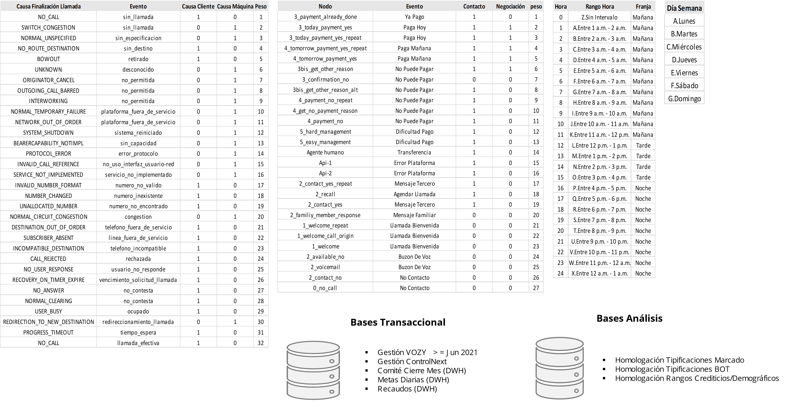

# Manual Reporte Gestores

## Indice

- [Manual Reporte Gestores](#manual-reporte-gestores)
   -[Indice](#indice)
  - [1.ALIADOS DE TRABAJO Y HERRAMIENTAS](#1-aliados-de-trabajo-y-herramientas)
  - [2.FUENTES DE TRABAJO](#2-fuentes-de-trabajo)
  - [3.DIMENSIÓN DE VARIABLES](#3-dimensión-de-variables)
  - [4.MENÚ](#4-menú)
  - [5.BOTON DE AYUDA)](#5-boton-de-ayuda)
  
## 1. ALIADOS DE TRABAJO Y HERRAMIENTAS

## 2. FUENTES DE TRABAJO

## 3. DIMENSIÓN DE VARIABLES

-Optimización de intervalos, focos y prácticas de gestión y ejecución por temporalidades.
-Descripción de variables de ejecución, comportamiento y otros factores de la gestión en controlnext
-Medición y retroalimentación de focos, gestores y canales de mayor eficiencia y efectividad (comportamiento variables Score asignación C-Universe).

## 4. MENÚ

Se genera la creacion de un menú flotante para dar espacio a las visualizaciónes y que contaran con una medida ideal para su correcta lectura, adicional ayudara a una forma más rapida de navegacion.

## 5. BOTON DE AYUDA

Se realiza la creación de este boton para que al dar clic pueda mostrar comentarios referentes a las visualizaciones que se encuentran segun cada vista y sea más facil la interpretacion de este tablero.

![Imagenes/botondeayuda.png](Imagenes/botondeayuda.png

## 5. BOTON DE AYUDA

## 5. BOTON DE AYUDA

## 5. BOTON DE AYUDA

