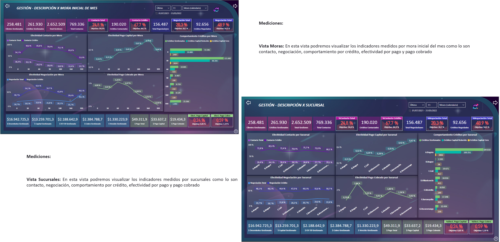

# Manual Reporte Gestores

## Indice

- [Manual Reporte Gestores](#manual-reporte-gestores)
  - [Indice](#indice)
  - [1. Recursos](#1-recursos)
    - [Aliados de trabajo y herramientas](#aliados-de-trabajo-y-herramientas)
    - [Fuentes de trabajo](#fuentes-de-trabajo)
    - [Dimensión de variables](#dimensión-de-variables)
  - [2. Herramientas](#2-herramientas)
    - [Menú](#menú)
    - [Boton de ayuda](#boton-de-ayuda)
    - [Filtro relacional](#filtro-relacional)
  - [3. Indicadores tarjetas](#3-indicadores-tarjetas)
    - [Gestión por mes](#gestión-por-mes)
  - [4. Indicadores graficos](#4-indicadores-graficos)
    - [Gestión por valor desembolsos](#gestión-por-valor-desembolsos)
    - [Gestión por mora inicial mes / por sucursal](#gestión-por-mora-inicial-mes--por-sucursal)
    - [Gestión por tipo identificación / capital inicio mes](#gestión-por-tipo-identificación--capital-inicio-mes)
    - [Gestión por tipo de alivio / por marca vehículo](#gestión-por-tipo-de-alivio--por-marca-vehículo)
    - [Gestión por producto / por tipo de prestamo](#gestión-por-producto--por-tipo-de-prestamo)
    - [Mejor gestión](#mejor-gestión)
    - [Mapa de calor y efectividad](#mapa-de-calor-y-efectividad)
    - [Gestión por asesor](#gestión-por-asesor)
    - [Gestión por canal y franja](#gestión-por-canal-y-franja)
    - [FIN](#fin)

## 1. Recursos

### Aliados de trabajo y herramientas

### Fuentes de trabajo

### Dimensión de variables

-Optimización de intervalos, focos y prácticas de gestión y ejecución por temporalidades.
-Descripción de variables de ejecución, comportamiento y otros factores de la gestión en controlnext
-Medición y retroalimentación de focos, gestores y canales de mayor eficiencia y efectividad (comportamiento variables Score asignación C-Universe).

## 2. Herramientas

### Menú

Se genera la creacion de un menú flotante para dar espacio a las visualizaciónes y que contaran con una medida ideal para su correcta lectura, adicional ayudara a una forma más rapida de navegacion.

### Boton de ayuda

Se realiza la creación de este boton para que al dar clic pueda mostrar comentarios referentes a las visualizaciones que se encuentran segun cada vista y sea más facil la interpretacion de este tablero.

### Filtro relacional

**Primer Recuadro:** Se podrá seleccionar un rango de meses “Último”, igualmente se puede seleccionar la opción “Este” para referenciar fecha o mes actual. Evitar usar la opción “Siguiente”.
**Segundo Recuadro:** Escribiendo un número se podrá seleccionar la temporalidad a consultar.
**Tercer Recuadro:** Preferiblemente seleccionar la opción “ Meses (calendario)”, aunque igualmente se pueden referenciar otras temporalidades.

## 3. Indicadores tarjetas

### Gestión por mes

**MEDICIONES:**

**Gestión x Cliente:** Gestiones realizadas al cliente por parte del asesor.
**Gestión x Cuenta:** Gestiones realizadas al crédito por parte del asesor.
**Gestión x Teléfono:** Gestiones realizadas a los telefonos por parte del asesor.  
**Gestión x Totales:**  Todas las gestiones realizadas por los asesores. 
**Contactos Totales:** Llamadas del asesor que confirma un contacto con el titular.
**Contactos Cuenta:** Llamadas del asesor que confirma un contacto por crédito.
**Negociaciones Totales:** Total de Llamadas donde el asesor  realiza acuerdo de pago con cliente / Llamadas donde se confirma titularidad.
**Negociaciones Cuentas:** Total de Llamadas donde el asesor  realiza acuerdo de pago por credito/ Llamadas donde se confirma titularidad.
**Filtro por segmentos en valores de continuo cálculo:** Rango Mora dimensionado bajo los segmentos preestablecidos por parte de la entidad, intervalos acorde al último insumo de comité.
**% Efect. Negociación:** Llamadas donde se realiza acuerdo de pago con cliente / Llamadas donde se confirma titularidad.
**% Efect. Contacto:** Llamadas del asesor que confirma un contacto con el titular.

## 4. Indicadores graficos

**Efectividad Contacto Por Año Desembolso:** Gestiones realizadas al cliente por parte del asesor.
**Efectividad Negociación Por Año Desembolso:** Negociaciones según la fecha realizadas a cliente con ese año de desembolso.
**Efectividad Pago Capital Por Año Desembolso:** Efectividad de pago de cliente con ese año de desembolso.
**Efectividad Pago Cobrado Por Año Desembolso:** Efectividad de pago cobrado por cliente con ese año de desembolso.
**Créditos Reducen Capital Por Año Desembolso:** Clientes que han reducido su Capital desde el año de desembolso

### Gestión por valor desembolsos

### Gestión por mora inicial mes / por sucursal

### Gestión por tipo identificación / capital inicio mes

### Gestión por tipo de alivio / por marca vehículo

### Gestión por producto / por tipo de prestamo

### Mejor gestión

**Cantidad Créditos por Mejor Gestión:** Son  la cantidad de créditos que han tenido como mejor gestión  cada una de las siguientes tipificaciones (Rango Y).
**Valor capital por Mejor Gestión :** El valor capital de los créditos que se han gestionado y su respectiva mejor tipología (Rango Y).
**Cliente reduce capital  por Mejor Gestión:** La cantidad de créditos que se han gestionado su respectiva mejor tipología y que han reducido su capital según la fecha filtrada (Rango Y).
**Valor Pago por Mejor Gestión :**El valor de pago a cuotas que registran con esa tipología de mejor gestión del asesor, para saber de que tipo de gestión fue que entró el pago

### Mapa de calor y efectividad

**% Efect.Contacto Por Fecha:** Porcentaje de Contacto por fecha.
**% Efect.Negociación Por Fecha:** Porcentaje de negociación por fecha.
**% Efect.Pago Acuerdo por Semana Año:** Porcentaje de los pagos de los acuerdos realizados por semana.
**Mapa de Calor :** Son los porcentajes de contacto y negociación de los créditos  según días calendario de la fecha filtrada, estos indicadores cuentan con formato condicional que nos indicaran en rojo los días que fueron menos efectivos y en verde los más

*Nota:* Es importante tener en cuenta que estos calendarios funciona solo si se filtra mes único, no varios meses

### Gestión por asesor

**Filtro por indicadores temporales:** Línea de tiempo por meses, esta puede ser modificada para seleccionar un campo específico de días que no interrumpa el espacio entre tablas dinámicas.
**Filtro por Rangos:** Sucursal, Tipo Alivio, Producto y Mora Inicial

**Tiempo Conversación:** Tiempo total de gestión de llamadas   (tipificación, llamada, observaciones).
**TMO Promedio:** Tiempo promedio de una gestión.
**Gestión:** Cantidad de registros tipificados
**Clientes Gestión:** Cantidad de registros tipificados por titular
**Cuentas Gestión:** Cantidad de registros tipificados por crédito
**Teléfono Gestión:** Total de teléfonos gestionados por el asesor.
**Contacto:** Llamadas que tiene contactos efectivos con titular
**Cuenta Contacto:** Llamadas que tiene contactos efectivos con titular por crédito
**%Contacto:** Total llamadas en porcentaje  donde se tiene contacto efectivo con el titular
**Negociación:** Llamadas donde se realiza un acuerdo de pago con el cliente
**Cuenta Negociación:** Llamadas donde se realiza un acuerdo de pago por crédito
**%Negociación:** Total llamadas en porcentaje donde se realiza un acuerdo de pago con el cliente
**Valor pago Total:** pagos aplicados a Capital intereses y otro
**Valor pago Capital:** Pagos aplicados a capital
**Valor pago Cobro:** Pagos aplicados a valor vencido o cuota
**Valor pago Contacto:** Pagos con contacto efectivo (pagos totales aplicados)
**Valor pago Acuerdo:** Pagos  de acuerdos (pagos totales aplicados)

### Gestión por canal y franja

En esta matriz se podrán observar por día de la semana y franja horaria la gestión de asesores por canal como los siguientes indicadores :

**Tiempo Conversación:** Tiempo total de gestión de llamadas   (tipificación, llamada, observaciones).
**WhatsApp Envío – Gestión:** Gestiones outbound en las que se genero un registro de tipificación.
**WhatsApp Envío – Contacto:** Gestiones outbound  tipificadas como contacto con titular.
**WhatsApp Envío – Negociación:** Gestiones outbound tipificadas como negociación con titular.
**WhatsApp Recibido – Gestión:** Gestiones inbound en las que se genero un registro de tipificación.
**WhatsApp Recibido – Contacto:** Gestiones inbound tipificadas como contacto con titular. 
**WhatsApp Recibido – Negociación:** Gestiones inbound tipificadas como negociación con titular. 
**Hacer Llamada- Gestión:** llamadas outbound en las que se genero un registro de tipificación.
**Hacer Llamada- Contacto :** llamadas outbound tipificadas como contacto con titular. 
**Hacer Llamada- Negociación :** llamadas outbound tipificadas como negociación con titular. 
**Recibir Llamada- Gestión:** llamadas inbound en las que se genero un registro de tipificación.
**Recibir Llamada- Contacto :** llamadas inbound tipificadas como contacto con titular. 
**Recibir Llamada- Negociación :** llamadas inbound tipificadas como negociación con titular. 
**Solicitud Visita – Gestión:**  Gestiones que registran tipificación de solicitud de visita por parte del titular.
**Solicitud Visita – Contacto:** Gestiones que registran tipificación de contacto y solicitud de visita por parte del titular.
**Solicitud Visita – Negociación:** Gestiones que registran tipificación negociación y solicitud de visita por parte del titular.
**Valor pago Total:**  La sumas de pagos Capital, intereses y seguros (solo se reflejan los que cuentan con gestión asesor).
**Valor pago Capital:** Pagos aplicados solo a capital (solo se reflejan los que cuentan con gestión asesor).
**Valor pago Cobro:**  Pagos  aplicados a saldo vencido o cuota mes (solo se reflejan los que cuentan con gestión asesor).
**Valor pago Contacto:**  Pagos Totales pero aplicado a los clientes que han sido contactados (solo se reflejan los que cuentan con gestión asesor). 
**Valor pago Acuerdo:** Pagos Totales pero aplicado a los clientes que han sido negociados (solo se reflejan los que cuentan con gestión asesor). 

### FIN

